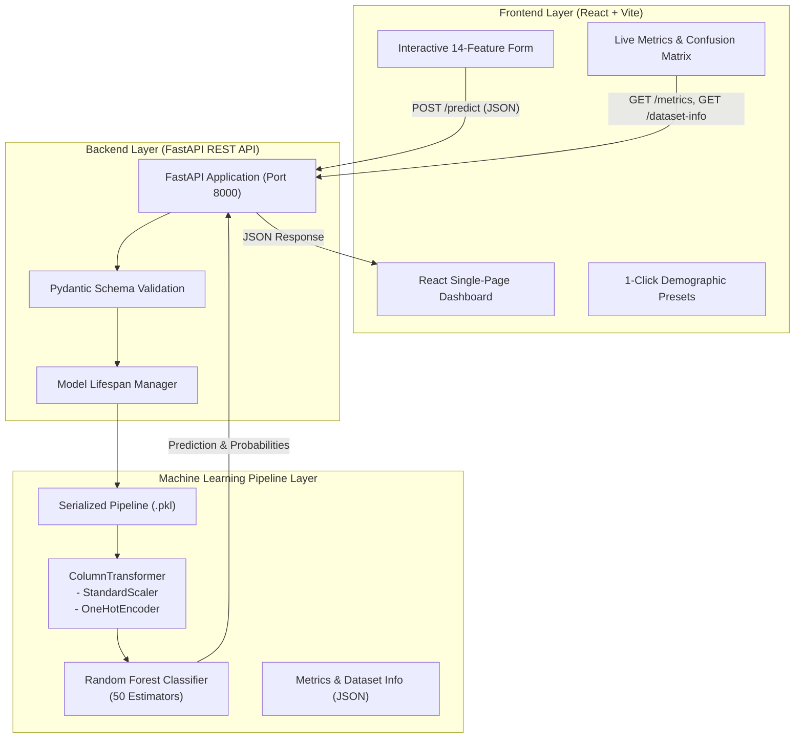

# 🏛️ Census Income Prediction System

> **An End-to-End Machine Learning System for Socio-Economic Income Classification Powered by Scikit-Learn, FastAPI, and React.**

[](https://census-income-prediction.vercel.app/)
[](https://www.python.org/)
[](https://fastapi.tiangolo.com/)
[](https://react.dev/)
[](https://vitejs.dev/)
[](https://scikit-learn.org/)
[](LICENSE)

---

> 🌐 **Live Web Application:** [https://census-income-prediction.vercel.app/](https://census-income-prediction.vercel.app/)

---

## 📑 Table of Contents

- [Overview & Problem Statement](#-overview--problem-statement)
- [Key Features](#-key-features)
- [System Architecture](#-system-architecture)
- [Repository Structure](#-repository-structure)
- [Dataset & Feature Specification](#-dataset--feature-specification)
- [Machine Learning Pipeline (Phase 1)](#-machine-learning-pipeline-phase-1)
  - [Model Benchmarks](#model-benchmarks)
  - [Confusion Matrix & Performance](#confusion-matrix--performance)
- [FastAPI Backend Service (Phase 2)](#-fastapi-backend-service-phase-2)
  - [REST API Endpoints](#rest-api-endpoints)
  - [Example Prediction Payload](#example-prediction-payload)
- [React Dashboard Frontend (Phase 3)](#-react-dashboard-frontend-phase-3)
- [Installation & Quick Start](#-installation--quick-start)
  - [Prerequisites](#prerequisites)
  - [One-Click Startup (Windows)](#1-one-click-startup-windows)
  - [Manual Setup](#2-manual-setup)
- [Environment Variables](#-environment-variables)
- [API Documentation & Testing](#-api-documentation--testing)
- [Academic Documentation](#-academic-documentation)
- [License & Acknowledgments](#-license--acknowledgments)

---

## 💡 Overview & Problem Statement

Income level classification is a fundamental problem in computational social science, public policy formulation, and financial risk assessment. 

The goal of this project is to build an automated, reliable binary classification engine that determines whether an individual's annual income exceeds **$50,000/year** (`>50K`) or is at or below **$50,000/year** (`<=50K`) based on 14 demographic, educational, and employment factors derived from the **US Census Bureau (Adult) Dataset**.

### Core Engineering Phases:
1. **Phase 1 — Machine Learning Pipeline**: Automated data acquisition, leakage-free preprocessing with scikit-learn `ColumnTransformer`, cross-model benchmarking, hyperparameter tuning, and pipeline serialization (`.pkl`).
2. **Phase 2 — Asynchronous REST API**: Production-grade **FastAPI** backend featuring strict Pydantic schemas, health checks, model caching in memory, CORS middleware, and OpenAPI/Swagger documentation.
3. **Phase 3 — Interactive Web Dashboard**: Modern **React + Vite** single-page application styled with a clean Blue & White SaaS theme, featuring dynamic input forms, preset sample profiles, confidence meters, live confusion matrix visualization, and dataset exploration.

---

## ✨ Key Features

- **Leakage-Free Preprocessing**: Unified `ColumnTransformer` handles numerical imputation + standard scaling and categorical imputation + one-hot encoding without data leakage.
- **Ensemble Machine Learning**: 50-tree Random Forest Classifier achieving **85.76% accuracy** and **0.7939 macro F1-score**.
- **Real-Time Probabilistic Predictions**: Returns both class decisions (`<=50K` or `>50K`) and exact probability distribution scores.
- **Interactive UI with Quick Presets**: Test demographic archetypes (e.g., Executive Profile, Entry-Level Worker, Blue-Collar Specialist) with a single click.
- **Model Explainability & Metrics Visualizer**: Interactive UI components for inspecting model performance metrics, class-wise precision/recall, and the full test confusion matrix.
- **Automated Startup**: Single-command runner (`start.bat`) to launch backend, frontend, and open the dashboard in browser.

---

## 🏗️ System Architecture



---

## 📂 Repository Structure

```text
Census-Income-Prediction/
├── .gitignore                           # Comprehensive gitignore for env & artifacts
├── PROJECT_PRESENTATION.md              # 15-Slide structured presentation notes
├── PROJECT_REPORT.md                    # Comprehensive 360+ line academic report
├── README.md                            # Main project documentation & guide
├── start.bat                            # 1-Click launcher for backend + frontend
│
├── backend/                             # Phase 2: FastAPI REST API
│   ├── README.md                        # Backend specific documentation
│   ├── main.py                          # FastAPI routes, schemas, and inference
│   ├── requirements.txt                 # Backend Python dependencies
│   └── model/                           # Deployed model artifacts
│       ├── census_income_model.pkl      # Serialized scikit-learn pipeline
│       ├── dataset_info.json            # Feature definitions & dataset metadata
│       └── model_metrics.json           # Evaluation metrics & confusion matrix
│
├── frontend/                            # Phase 3: React Single Page Application
│   ├── .env.example                     # Frontend environment template
│   ├── .gitignore                       # Frontend-specific gitignore
│   ├── README.md                        # Frontend documentation & architecture
│   ├── index.html                       # HTML5 entrypoint
│   ├── package.json                     # Node.js dependencies and scripts
│   ├── vite.config.js                   # Vite bundler configuration
│   └── src/
│       ├── App.jsx                      # App root component
│       ├── main.jsx                     # React DOM entrypoint
│       ├── index.css                    # Design system, CSS variables & animations
│       ├── components/                  # Modular React UI components
│       │   ├── Navbar.jsx               # Header navigation & system status
│       │   ├── PredictionForm.jsx       # 14-attribute form with preset buttons
│       │   ├── PredictionResult.jsx     # Result cards & probability meters
│       │   ├── ModelPerformance.jsx     # Confusion matrix & benchmark tables
│       │   ├── DatasetInfoSection.jsx   # Feature dictionary & data distribution
│       │   ├── MetricCard.jsx           # Reusable metric card
│       │   └── AboutSection.jsx         # Project overview & architecture details
│       ├── data/
│       │   └── featureOptions.js        # Categorical dropdown options & presets
│       ├── pages/
│       │   └── Dashboard.jsx            # Main dashboard controller view
│       └── services/
│           └── api.js                   # Axios HTTP client configuration
│
└── model-training/                      # Phase 1: Data Science & ML Training
    ├── Census_Income_Model (1).ipynb    # Interactive Jupyter Notebook
    ├── README.md                        # Training pipeline documentation
    ├── train_model.py                   # Automated Python training script
    ├── requirements.txt                 # Model training dependencies
    ├── census_income_model.pkl          # Trained serialized model
    ├── dataset_info.json                # Extracted dataset metadata
    └── model_metrics.json               # Model evaluation export
```

---

## 📊 Dataset & Feature Specification

The model trains on the **OpenML Adult / Census Income Dataset (v2)** containing **48,842 records** across 14 input attributes.

### Feature Dictionary

| Feature Name | Type | Description | Values / Range |
| :--- | :--- | :--- | :--- |
| `age` | Numerical | Age of individual | 17 to 90 years |
| `workclass` | Categorical | Employment sector | *Private, Self-emp-not-inc, Self-emp-inc, Federal-gov, Local-gov, State-gov, Without-pay, Never-worked* |
| `fnlwgt` | Numerical | Final census sampling weight | 12,285 to 1,484,705 |
| `education` | Categorical | Highest education level completed | *Bachelors, Some-college, 11th, HS-grad, Prof-school, Assoc-acdm, Assoc-voc, 9th, 7th-8th, 12th, Masters, 1st-4th, 10th, Doctorate, 5th-6th, Preschool* |
| `education-num` | Numerical | Years/level of education completed | 1 to 16 |
| `marital-status` | Categorical | Marital status | *Married-civ-spouse, Divorced, Never-married, Separated, Widowed, Married-spouse-absent, Married-AF-spouse* |
| `occupation` | Categorical | Professional job category | *Tech-support, Craft-repair, Other-service, Sales, Exec-managerial, Prof-specialty, Handlers-cleaners, Machine-op-inspct, Adm-clerical, Farming-fishing, Transport-moving, Priv-house-serv, Protective-serv, Armed-Forces* |
| `relationship` | Categorical | Relationship to householder | *Wife, Own-child, Husband, Not-in-family, Other-relative, Unmarried* |
| `race` | Categorical | Race/ethnicity | *White, Asian-Pac-Islander, Amer-Indian-Eskimo, Other, Black* |
| `sex` | Categorical | Biological sex | *Female, Male* |
| `capital-gain` | Numerical | Recorded capital gains | $0 to $99,999 |
| `capital-loss` | Numerical | Recorded capital losses | $0 to $4,356 |
| `hours-per-week` | Numerical | Work hours per week | 1 to 99 hours |
| `native-country` | Categorical | Country of origin | 41 unique countries |

**Target Variable (`class`)**: Binary label indicating whether income is `<=50K` (76.07%) or `>50K` (23.93%).

---

## 🤖 Machine Learning Pipeline (Phase 1)

The pipeline integrates preprocessing and classification into an atomic scikit-learn `Pipeline` object:

```python
preprocessor = ColumnTransformer(transformers=[
    ('num', Pipeline([
        ('imputer', SimpleImputer(strategy='median')),
        ('scaler', StandardScaler())
    ]), numerical_features),
    ('cat', Pipeline([
        ('imputer', SimpleImputer(strategy='most_frequent')),
        ('encoder', OneHotEncoder(handle_unknown='ignore', sparse_output=False))
    ]), categorical_features)
])

pipeline = Pipeline([
    ('preprocessor', preprocessor),
    ('classifier', RandomForestClassifier(n_estimators=50, random_state=42, n_jobs=-1))
])
```

### Model Benchmarks

| Model | Parameters | Test Accuracy | Macro Precision | Macro Recall | Macro F1-Score | Status |
| :--- | :--- | :--- | :--- | :--- | :--- | :--- |
| **Random Forest Classifier** | `n_estimators=50, random_state=42` | **85.76%** | **81.28%** | **77.96%** | **0.7939** | **Selected** |
| **Logistic Regression** | `max_iter=1000, random_state=42` | 85.24% | 80.70% | 76.51% | 0.7818 | Baseline |

### Confusion Matrix & Performance

Evaluated on **9,769 unseen test records** (80/20 stratified split):

```
                   Predicted <=50K       Predicted >50K
Actual <=50K       6,905 (TN)            526 (FP)
Actual >50K          865 (FN)          1,473 (TP)
```

- **Class `<=50K`**: Precision: **88.87%** | Recall: **92.92%** | F1-Score: **0.9085** (Support: 7,431)
- **Class `>50K`**: Precision: **73.69%** | Recall: **63.00%** | F1-Score: **0.6793** (Support: 2,338)

---

## ⚡ FastAPI Backend Service (Phase 2)

The backend provides high-throughput, non-blocking asynchronous REST endpoints built on top of FastAPI and Uvicorn.

### REST API Endpoints

| Method | Endpoint | Description | Query / Body |
| :--- | :--- | :--- | :--- |
| `GET` | `/` | API status, title, version, and documentation links | None |
| `GET` | `/health` | Healthcheck & model readiness verification | None |
| `GET` | `/metrics` | Actual test metrics, confusion matrix, & comparisons | None |
| `GET` | `/dataset-info` | Metadata schema, feature lists, and descriptions | None |
| `POST` | `/predict` | Primary prediction inference endpoint | JSON (`CensusIncomeInput`) |

### Example Prediction Payload

#### Request (`POST /predict`):
```json
{
  "age": 42,
  "workclass": "Private",
  "fnlwgt": 150000,
  "education": "Masters",
  "education-num": 14,
  "marital-status": "Married-civ-spouse",
  "occupation": "Exec-managerial",
  "relationship": "Husband",
  "race": "White",
  "sex": "Male",
  "capital-gain": 5000,
  "capital-loss": 0,
  "hours-per-week": 45,
  "native-country": "United-States"
}
```

#### Response:
```json
{
  "prediction": ">50K",
  "probabilities": {
    "<=50K": 0.18,
    ">50K": 0.82
  },
  "model_name": "Random Forest Classifier",
  "timestamp": "2026-09-24T09:30:00.000000"
}
```

---

## 💻 React Dashboard Frontend (Phase 3)

The user interface delivers a modern web dashboard built with React 18, Vite, and custom CSS design tokens.

### Key UI Capabilities:
- **Prediction Form**: 14 dynamic input fields grouped logically into Demographics, Education & Occupation, and Financial Information.
- **1-Click Profile Presets**: Rapidly populate realistic archetypes:
  - *High-Income Executive*: Masters degree, Exec-Managerial, high capital gain.
  - *Entry-Level Worker*: HS-grad, Private sector, younger age.
  - *Self-Employed Professional*: Doctorate, Self-emp-inc, 50 hours/week.
  - *Blue-Collar Specialist*: Craft-repair, married, 40 hours/week.
- **Dynamic Confidence Breakdown**: Color-coded probability bars visualizing model uncertainty.
- **Interactive Metrics Explorer**: Tabbed view displaying the 2x2 confusion matrix with true/false statistics and metric summary cards.
- **Dataset Feature Catalog**: Searchable/browseable feature definitions with type badges.

---

## 🚀 Installation & Quick Start

### Prerequisites
- **Python**: Version 3.10 or higher
- **Node.js**: Version 18.x or higher (with npm)
- **Git**

---

### 1. One-Click Startup (Windows)

Simply double-click [`start.bat`](file:///c:/Project/Census-Income-Prediction/start.bat) or run from PowerShell / Command Prompt:

```powershell
.\start.bat
```

This script will automatically:
1. Validate Python and Node.js availability.
2. Launch the FastAPI backend on `http://127.0.0.1:8000`.
3. Launch the React Vite frontend on `http://127.0.0.1:5173`.
4. Open the Web Dashboard in your default web browser.

---

### 2. Manual Setup

#### Step A: Backend Setup
```bash
# 1. Navigate to backend directory
cd backend

# 2. (Optional) Create and activate virtual environment
python -m venv venv
# On Windows:
venv\Scripts\activate
# On Linux/macOS:
# source venv/bin/activate

# 3. Install Python dependencies
pip install -r requirements.txt

# 4. Start the FastAPI server
uvicorn main:app --host 127.0.0.1 --port 8000 --reload
```

Backend will be live at:
- **API Root**: [http://127.0.0.1:8000](http://127.0.0.1:8000)
- **Interactive Swagger Docs**: [http://127.0.0.1:8000/docs](http://127.0.0.1:8000/docs)
- **ReDoc Documentation**: [http://127.0.0.1:8000/redoc](http://127.0.0.1:8000/redoc)

#### Step B: Frontend Setup
```bash
# 1. In a new terminal, navigate to frontend directory
cd frontend

# 2. Install npm dependencies
npm install

# 3. Start Vite development server
npm run dev -- --host 127.0.0.1 --port 5173
```

Frontend will be live at: [http://127.0.0.1:5173](http://127.0.0.1:5173)

#### Step C: (Optional) Retrain ML Model
```bash
cd model-training
pip install -r requirements.txt
python train_model.py
```

---

## 🚀 Public Cloud Deployment Guide

This project is structured for easy deployment to **Render** (FastAPI Backend) and **Vercel** (React Frontend).

### 1. Backend Deployment (Render)

1. Sign in to [Render](https://render.com/) and click **New +** $\rightarrow$ **Web Service**.
2. Connect your GitHub repository: `aryarewatkar2405-crypto/Census-Income-Prediction-CM24073`.
3. Configure the service parameters:
   - **Name**: `census-income-backend` (or your choice)
   - **Region**: Any (e.g., Oregon, Frankfurt)
   - **Branch**: `main`
   - **Root Directory**: `backend`
   - **Runtime**: `Python 3`
   - **Build Command**: `pip install -r requirements.txt`
   - **Start Command**: `uvicorn main:app --host 0.0.0.0 --port $PORT`
4. *(Optional)* Add Environment Variables under **Advanced**:
   - `FRONTEND_URL`: `https://<YOUR-VERCEL-APP-NAME>.vercel.app` (Can be set after frontend deployment)
5. Click **Create Web Service**. Once deployed, copy your Render backend URL (e.g., `https://census-income-backend.onrender.com`).

---

### 2. Frontend Deployment (Vercel)

1. Sign in to [Vercel](https://vercel.com/) and click **Add New...** $\rightarrow$ **Project**.
2. Import your GitHub repository: `aryarewatkar2405-crypto/Census-Income-Prediction-CM24073`.
3. Configure project settings:
   - **Framework Preset**: `Vite`
   - **Root Directory**: Click *Edit* and select `frontend`
   - **Build Command**: `npm run build`
   - **Output Directory**: `dist`
4. Expand **Environment Variables** and add:
   - **Key**: `VITE_API_URL`
   - **Value**: `https://<YOUR-RENDER-BACKEND-URL>` (e.g., `https://census-income-backend.onrender.com`)
5. Click **Deploy**. Vercel will build and assign the production URL: [https://census-income-prediction.vercel.app/](https://census-income-prediction.vercel.app/).

---

### 3. Connecting Frontend & Backend

1. Once your Vercel deployment completes, your frontend is accessible at [https://census-income-prediction.vercel.app/](https://census-income-prediction.vercel.app/).
2. In Render, navigate to your backend web service $\rightarrow$ **Environment** $\rightarrow$ set `FRONTEND_URL` to `https://census-income-prediction.vercel.app`.
3. Your full-stack cloud deployment is now live and fully linked!

---

## 🔐 Environment Variables

Environment variables are managed safely via `.env` files (which are ignored by Git):

### Frontend (`frontend/.env.local` or Vercel Settings)
```ini
# FastAPI Backend URL
VITE_API_URL=http://127.0.0.1:8000
```
*(A template is provided in [`frontend/.env.example`](file:///c:/Project/Census-Income-Prediction/frontend/.env.example))*

### Backend (`backend/.env` or Render Settings)
```ini
# Optional: Allowed Frontend Origin for CORS (e.g., Vercel domain)
FRONTEND_URL=https://your-app.vercel.app
PORT=8000
```

---

## 🧪 API Documentation & Testing

You can test the prediction endpoint directly using `curl` or PowerShell:

```bash
curl -X POST "http://127.0.0.1:8000/predict" \
     -H "Content-Type: application/json" \
     -d '{
       "age": 39,
       "workclass": "State-gov",
       "fnlwgt": 77516,
       "education": "Bachelors",
       "education-num": 13,
       "marital-status": "Never-married",
       "occupation": "Adm-clerical",
       "relationship": "Not-in-family",
       "race": "White",
       "sex": "Male",
       "capital-gain": 2174,
       "capital-loss": 0,
       "hours-per-week": 40,
       "native-country": "United-States"
     }'
```

---

## 📚 Academic Documentation

Detailed technical reports and presentation slides are included in the repository:
- **Comprehensive Project Report**: [`PROJECT_REPORT.md`](file:///c:/Project/Census-Income-Prediction/PROJECT_REPORT.md) — 12-section standard academic report with theoretical formulations, data distribution tables, and error analyses.
- **Project Presentation Deck**: [`PROJECT_PRESENTATION.md`](file:///c:/Project/Census-Income-Prediction/PROJECT_PRESENTATION.md) — 15-slide structured deck formatted for technical seminars and viva presentations.

---

## 📄 License & Acknowledgments

- **License**: Distributed under the MIT License.
- **Dataset**: US Census Bureau Adult Dataset, accessible via [OpenML Dataset 1590](https://www.openml.org/d/1590).
- **Libraries**: [Scikit-Learn](https://scikit-learn.org/), [FastAPI](https://fastapi.tiangolo.com/), [React](https://react.dev/), [Vite](https://vitejs.dev/), [Lucide Icons](https://lucide.dev/).
